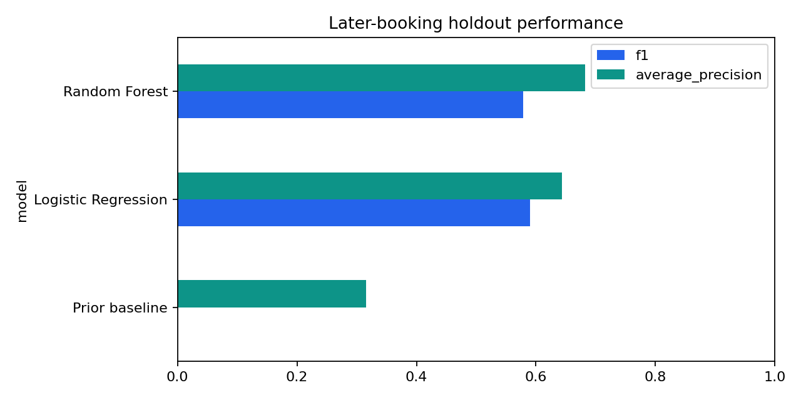

# Hotel booking cancellation risk

A historical modelling case study asking whether booking characteristics can identify cancellations in a **later booking period**. Built with Python, scikit-learn and SHAP using the public Hotel Booking Demand dataset.

## Current evidence

The executed notebook, metrics CSVs and source fingerprint in `outputs/` are the authoritative results of the revised analysis. The earlier random-split scores are superseded; the old office documents and `figures/` are archived project material.



[Classification metrics](outputs/classification_metrics.csv) · [Retrospective regression metrics](outputs/regression_metrics.csv) · [Split and source manifest](outputs/validation.json)

| Model | F1 | Precision | Recall | Average precision |
|---|---:|---:|---:|---:|
| Prior baseline | 0.0000 | 0.0000 | 0.0000 | 0.3152 |
| Logistic Regression | 0.5901 | 0.4676 | 0.7996 | 0.6438 |
| Random Forest | 0.5784 | 0.6017 | 0.5569 | 0.6819 |

Logistic Regression has the higher F1 at threshold 0.5; Random Forest has the stronger ranking by average precision and ROC AUC. There is no single best model independent of the operating objective.

## Validation design

- Retain all 119,390 rows. No booking identifier is supplied, so identical rows are not automatically assumed to be duplicate bookings.
- Infer booking date as scheduled arrival minus lead time; choose the cutoff at the 80th percentile of booking dates.
- Reserve bookings on/after the cutoff for testing. Training bookings must have both a scheduled stay end and a resolved outcome before the cutoff, to avoid an outcome-dependent cohort of only early cancellations.
- Fit imputation, scaling and categorical encoding on training data only.
- Use an explicit feature list; exclude final reservation status, assigned room, booking changes, waiting-list duration and mutable special-request/parking counts.
- Compare with a prior-probability baseline and report precision, recall, F1, average precision and ROC AUC. Classification threshold is fixed at 0.5 and is not tuned on test data.

The source is a historical snapshot: this design reduces leakage risks but cannot establish that every retained attribute was unchanged since booking. One later holdout does not establish performance across multiple seasons or properties.

## Business interpretation

Predictive ranking and operating decisions are separate questions. Evaluate the cost of false positives and missed cancellations, select a threshold on a separate validation period, and test interventions before claiming revenue uplift. SHAP describes model behaviour; it does not show that changing a feature will prevent a cancellation.

The lead-time regression is a **retrospective booking-profile exercise**, not a validated pre-booking forecast: several predictors are known only once a booking exists. It should not be used to claim that the project can forecast future booking lead times operationally.

## Reproduce

Tested with Python 3.12. In a virtual environment:

```bash
pip install -r requirements.txt
python scripts/download_data.py
```

Run every cell in `notebooks/Hotel_Booking_Complete.ipynb` from its folder. Outputs are regenerated under `outputs/`. The download checks the exact source SHA-256; the raw CSV is not committed.

Source: [TidyTuesday Hotel Booking Demand mirror](https://github.com/rfordatascience/tidytuesday/tree/master/data/2020/2020-02-11). Consult the source's documentation and attribution before redistributing the dataset.

## Context and authorship

Dimitrios Bechrakis · MSc Data Science, The American College of Greece. This portfolio revision was prepared with AI assistance. It makes the analysis and its assumptions reviewable and does not claim production deployment or realised business impact.
