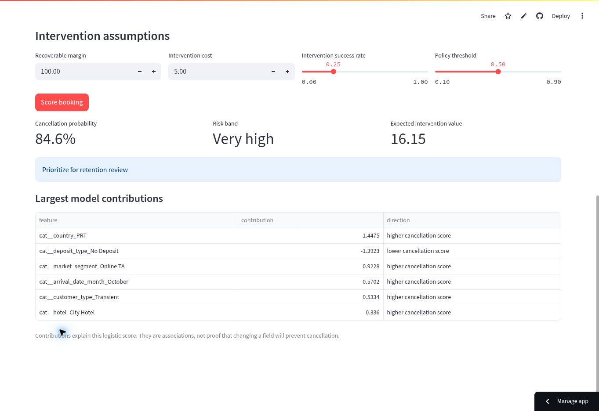
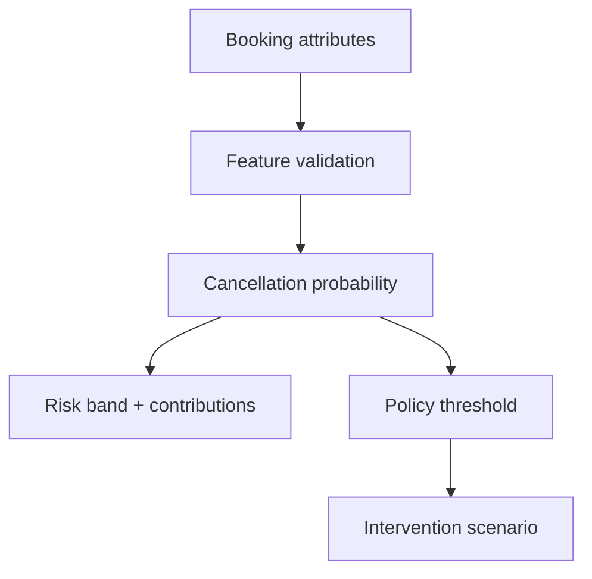

# Hotel Cancellation Risk Decision System

[](https://github.com/dbechrakis/hotel-booking-cancellation-ml/actions/workflows/evidence.yml)

An end-to-end machine-learning decision product that ranks hotel booking cancellation risk, explains individual scores, and translates model probabilities into transparent intervention-policy scenarios.

**Stack:** Python · pandas · scikit-learn · SHAP · Streamlit · joblib

**[Try the live decision app](https://dbechrakis-hotel-cancellation.streamlit.app/)** · [Inspect the holdout evidence](VALIDATION.md) · [Read the design choices](docs/architecture.md#design-decisions)

## Decision in 60 seconds

| Question | Evidence | Decision supported | Boundary |
|---|---|---|---|
| Which bookings merit a limited retention review? | A logistic model achieved **0.590 F1** and **0.800 recall** at a 0.50 cutoff on **23,989 later bookings**. | Explore a review threshold and contact capacity using the holdout simulator; prioritize a booking only when its risk clears the threshold **and** assumed expected value is positive. | The intervention success rate and recoverable margin are assumptions. No retention uplift or production outcome has been measured. |

[Read the business analysis case: user need, requirements and acceptance scenarios](docs/business-analysis-case.md).



The live app scores a booking and simulates contact policies against a saved later-period holdout. The screenshot shows one example with the default assumptions; the displayed economic value is a scenario, not measured intervention uplift.

## Business problem

Hotels cannot contact every booking with the same retention effort. A useful system must answer more than “will this booking cancel?” It must connect risk ranking to an operating decision:

- Which bookings should be reviewed first?
- How does the contact threshold change workload, precision, and cancellation recall?
- Under explicit assumptions about intervention cost and effectiveness, which policy has positive expected value?
- Which booking attributes pushed an individual score higher or lower?

This repository separates those questions. The model estimates historical cancellation risk; the decision layer applies user-controlled economics. It does **not** claim that contacting a guest causally prevents cancellation.

## Product flow


```mermaid
flowchart TD
    A["Booking attributes"] --> B["Feature validation"]
    B --> C["Cancellation probability"]
    C --> D["Risk band + contributions"]
    C --> E["Policy threshold"]
    E --> F["Intervention scenario"]
```

The Streamlit application has three connected views:

1. **Score a booking** — probability, risk band, assumed intervention value, recommendation, and largest logistic contributions.
2. **Threshold simulator** — workload, precision, recall, missed cancellations, and assumed net value across thresholds on the later-period holdout.
3. **Model evidence** — validation design, row counts, metrics, and explicit limitations.

## Validated model evidence

The analysis uses all 119,390 rows from the public Hotel Booking Demand snapshot and an inferred booking-date split. Training observations must precede the cutoff and have both their scheduled stay and outcome resolved before it. Later bookings form the holdout.

| Model | F1 | Precision | Recall | Average precision | ROC AUC |
|---|---:|---:|---:|---:|---:|
| Prior baseline | 0.0000 | 0.0000 | 0.0000 | 0.3152 | 0.5000 |
| **Logistic Regression** | **0.5901** | 0.4676 | **0.7996** | 0.6438 | 0.7748 |
| Random Forest | 0.5784 | **0.6017** | 0.5569 | **0.6819** | **0.8089** |

There is no universally best model. Random Forest ranks the holdout better, while Logistic Regression has stronger recall and F1 at the fixed 0.50 threshold. The deployed portfolio artifact uses Logistic Regression because it is compact, directly explainable through signed contributions, and exactly reproduces the committed chronological-holdout metrics.

[Classification metrics](outputs/classification_metrics.csv) · [Compressed holdout probabilities](outputs/holdout_predictions.csv.gz) · [Split manifest](outputs/validation.json)

## Validation design

- **Train:** 79,590 matured bookings.
- **Test:** 23,989 later bookings.
- **Purged:** 15,811 bookings that did not satisfy the matured-training or later-test contract.
- **Cutoff:** 2017-01-12.
- Imputation, scaling, and encoding are fitted on training data only.
- Final reservation status, assigned room, booking changes, waiting-list duration, and mutable request/parking counts are excluded.
- Classification threshold 0.50 was not tuned on the test data.
- The source file and exported model are protected by SHA-256 fingerprints.

The design reduces obvious temporal and outcome leakage. It does not prove stability across future seasons, new hotels, or changed operating policies.

## Decision economics

For one booking, the application calculates:

```text
Expected intervention value
= cancellation probability × assumed intervention success × recoverable margin
− intervention cost
```

For the holdout policy simulator:

```text
Assumed net value
= identified cancellations × assumed intervention success × recoverable margin
− contacted bookings × intervention cost
```

These formulas are scenarios, not realised uplift. The dataset contains no randomized retention intervention, so success rate and recoverable margin must be supplied as assumptions.

## Repository structure

```text
hotel-booking-cancellation-ml/
├── app/
│   └── streamlit_app.py              # Risk + policy application
├── artifacts/
│   ├── cancellation_logistic.joblib  # Compact validated pipeline
│   └── model_metadata.json           # Contract, metrics, defaults, hashes
├── src/hotel_cancellation/
│   ├── contracts.py                  # Explicit 22-feature contract
│   ├── data.py                       # Matured chronological split
│   ├── model.py                      # Training/inference/explanations
│   └── decision.py                   # Risk bands and economics
├── notebooks/                        # Executed modelling study
├── scripts/
│   ├── download_data.py              # Fingerprinted public source
│   └── train_decision_artifacts.py   # Reproducible export
├── tests/                             # Decision and artifact tests
├── outputs/                           # Metrics, figures, holdout evidence
├── docs/                              # Architecture + archived reports
├── pyproject.toml
└── requirements.txt
```

## Run locally

Tested with Python 3.12:

```bash
python3 -m venv .venv
source .venv/bin/activate
python -m pip install -r requirements.txt
python -m streamlit run app/streamlit_app.py
```

The committed model artifact and holdout predictions are enough to run the application.

For Streamlit Community Cloud, select this repository's `main` branch, set the
entrypoint to `app/streamlit_app.py`, and choose Python 3.12 in advanced settings.
The app-specific [`app/requirements.txt`](app/requirements.txt) installs only
the runtime dependencies; the root requirements file remains for reproducing
the full modelling study. The application uses the committed artifact and
historical holdout, so deployment does not download or retrain source data.

To reproduce training from the fingerprinted source:

```bash
python scripts/download_data.py
python scripts/train_decision_artifacts.py
python -m unittest discover -s tests -v
```

The export script refuses to continue if the source fingerprint or reproduced Logistic Regression metrics differ from the committed evidence.

## Model interpretation and limitations

- Logistic contributions explain the score mechanically; they are not causal effects.
- The risk score is a ranking tool, not a guarantee for an individual booking.
- Probabilities are not claimed to be perfectly calibrated.
- The threshold simulator reuses one historical holdout for scenario exploration; it is not a second independent validation.
- Intervention effectiveness, guest response, margin recovery, and contact cost are not observed in the dataset.
- Before operational use, the system would require repeated temporal backtesting, calibration monitoring, fairness/privacy review, and a controlled intervention experiment.

See [VALIDATION.md](VALIDATION.md) and [architecture contracts](docs/architecture.md) for the exact verification boundary.

## Context and authorship

Applied machine-learning portfolio project by **Dimitris Bechrakis**, MSc Data Science at **The American College of Greece**. The historical office documents and older `figures/` directory are retained as archived project material; the notebook, artifacts, tests, and `outputs/` are the current evidence.

Business Analyst | Commercial Analytics · Data Products · Applied Data Science

## Licensing

See [LICENSING.md](LICENSING.md) for the MIT-licensed verification code and separately governed project materials.
