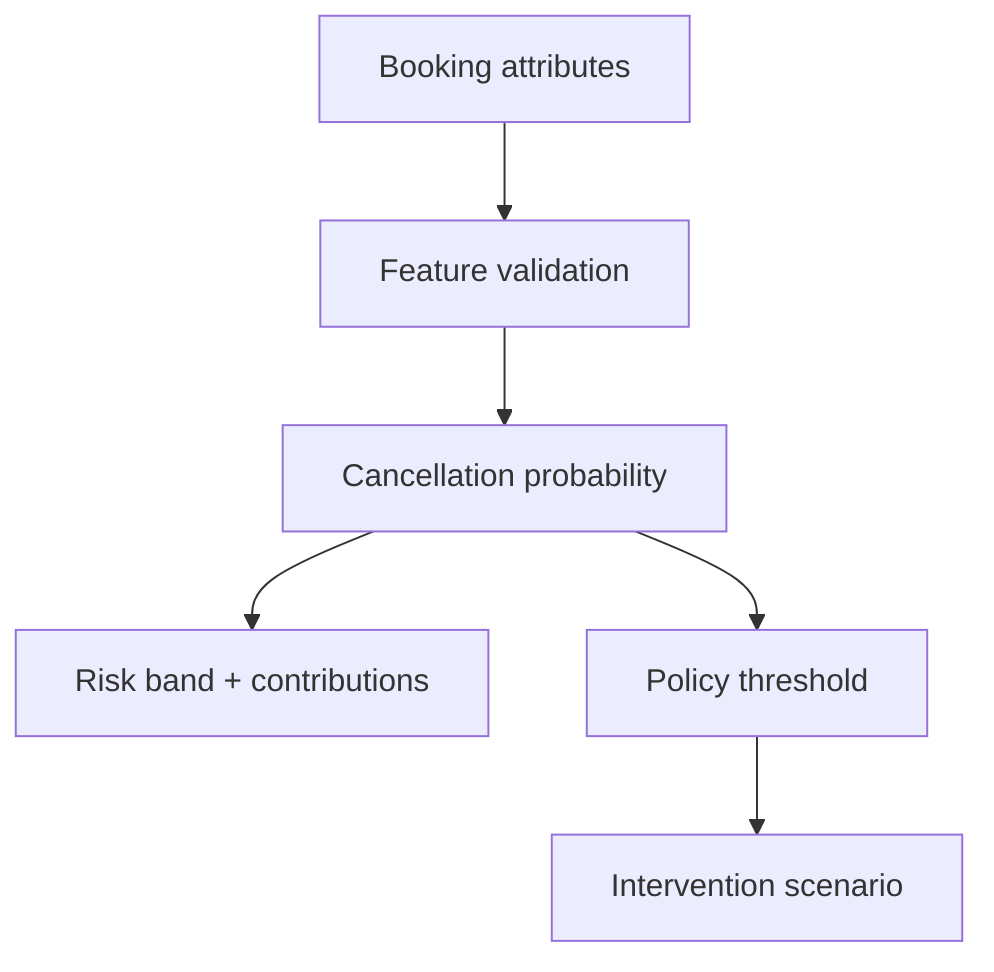

# Hotel Cancellation Risk Decision System

[](https://github.com/dbechrakis/hotel-booking-cancellation-ml/actions/workflows/evidence.yml)

An end-to-end machine-learning decision product that ranks hotel booking cancellation risk, explains individual scores, and translates calibrated probabilities into transparent intervention-policy scenarios.

**Stack:** Python · pandas · scikit-learn · SHAP · FastAPI · MLflow · Docker · Streamlit

**[Try the live decision app](https://dbechrakis-hotel-cancellation.streamlit.app/)** · [Scoring API](#scoring-api) · [Experiment tracking](docs/experiment-tracking.md) · [Calibration](docs/calibration.md) · [Inspect the holdout evidence](VALIDATION.md) · [Read the design choices](docs/architecture.md#design-decisions)

## Decision in 60 seconds

| Question | Evidence | Decision supported | Boundary |
|---|---|---|---|
| Which bookings merit a limited retention review? | A logistic model achieved **0.591 F1** and **0.812 recall** at a 0.50 risk-score cutoff on **23,989 later bookings**. Isotonic calibration cut the probability calibration error from **0.221 to 0.013** on later bookings. | Explore a review threshold and contact capacity using the holdout simulator; prioritize a booking only when its risk clears the threshold **and** assumed expected value is positive. | The intervention success rate and recoverable margin are assumptions. No retention uplift or production outcome has been measured. |

[Read the business analysis case: user need, requirements and acceptance scenarios](docs/business-analysis-case.md).

[See how the assumed uplift would be measured: A/B design and sample sizes](docs/experiment-design.md).


The live app scores a booking and simulates contact policies against a saved later-period holdout. The screenshot shows one example with the default assumptions; the displayed economic value is a scenario, not measured intervention uplift.

## Business problem

Hotels cannot contact every booking with the same retention effort. A useful system must answer more than “will this booking cancel?” It must connect risk ranking to an operating decision:

- Which bookings should be reviewed first?
- How does the contact threshold change workload, precision, and cancellation recall?
- Under explicit assumptions about intervention cost and effectiveness, which policy has positive expected value?
- Which booking attributes pushed an individual score higher or lower?

This repository separates those questions. The model estimates historical cancellation risk; the decision layer applies user-controlled economics. It does **not** claim that contacting a guest causally prevents cancellation.

## Product flow


```mermaid
flowchart TD
    A["Booking attributes"] --> B["Feature validation"]
    B --> C["Cancellation probability"]
    C --> D["Risk band + contributions"]
    C --> E["Policy threshold"]
    E --> F["Intervention scenario"]
```

The Streamlit application has three connected views:

1. **Score a booking** — probability, risk band, assumed intervention value, recommendation, and largest logistic contributions.
2. **Threshold simulator** — workload, precision, recall, missed cancellations, and assumed net value across thresholds on the later-period holdout.
3. **Model evidence** — validation design, row counts, metrics, and explicit limitations.

## Validated model evidence

The analysis uses all 119,390 rows from the public Hotel Booking Demand snapshot and an inferred booking-date split. Training observations must precede the cutoff and have both their scheduled stay and outcome resolved before it. Later bookings form the holdout.

| Model | F1 | Precision | Recall | Average precision | ROC AUC |
|---|---:|---:|---:|---:|---:|
| Prior baseline | 0.0000 | 0.0000 | 0.0000 | 0.3152 | 0.5000 |
| **Logistic Regression** | **0.5905** | 0.4641 | **0.8115** | 0.6444 | 0.7750 |
| Random Forest | 0.5784 | **0.6017** | 0.5569 | **0.6819** | **0.8089** |

There is no universally best model. Random Forest ranks the holdout better, while Logistic Regression has stronger recall and F1 at the fixed 0.50 threshold. The deployed portfolio artifact uses Logistic Regression because it is compact, directly explainable through signed contributions, and exactly reproduces the committed chronological-holdout metrics.

### Tracked model comparison

[`scripts/track_experiments.py`](scripts/track_experiments.py) reruns the comparison under MLflow with a gradient-boosting candidate added. It selects on an inner chronological validation window inside the training period, then scores every candidate once on the holdout. It also records calibration (Brier score) and registers the deployed pipeline as `hotel-cancellation-risk@production`.

| Model | Validation AP (selects) | Holdout AP | Holdout Brier |
|---|---:|---:|---:|
| Logistic Regression (deployed, raw score) | 0.467 | 0.644 | 0.218 |
| Random Forest (selected) | **0.528** | 0.682 | 0.164 |
| Hist Gradient Boosting | 0.517 | **0.695** | **0.163** |

Validation and holdout disagree on the best tree model, so the holdout winner is not presented as the selected model. The raw logistic score ranks well enough for a review queue, but it is not a probability: its Brier score equals the base-rate 0.218. [Protocol and full results](docs/experiment-tracking.md).

### Calibrated probabilities

The class-weighted score averages 51% on later bookings while 29% cancel. Expected intervention value multiplies a probability by money, so it needs calibration. The system serves the raw **risk score** for ranking and the 0.50 threshold, and an **isotonic-calibrated probability** for risk bands and economics. The calibrator was fitted on the earliest 30% of later bookings and evaluated on the other 16,835:

| | Brier | ECE | Mean predicted vs observed |
|---|---:|---:|---:|
| Raw risk score | 0.229 | 0.221 | 51.2% vs 29.2% |
| **Isotonic probability** | **0.174** | **0.013** | **30.1% vs 29.2%** |

A calibrator fitted inside the training period did not transfer, because `arrival_date_year` is numeric and scores extrapolate by year. [Protocol, reliability diagram and the failed attempt](docs/calibration.md).

[Classification metrics](outputs/classification_metrics.csv) · [Compressed holdout scores and probabilities](outputs/holdout_predictions.csv.gz) · [Split manifest](outputs/validation.json)

## Validation design

- **Train:** 79,590 matured bookings.
- **Test:** 23,989 later bookings.
- **Purged:** 15,811 bookings that did not satisfy the matured-training or later-test contract.
- **Cutoff:** 2017-01-12.
- Imputation, scaling, and encoding are fitted on training data only.
- Final reservation status, assigned room, booking changes, waiting-list duration, and mutable request/parking counts are excluded.
- Classification threshold 0.50 was not tuned on the test data.
- The source file and exported model are protected by SHA-256 fingerprints.

The design reduces obvious temporal and outcome leakage. It does not prove stability across future seasons, new hotels, or changed operating policies.

## Decision economics

For one booking, the application calculates:

```text
Expected intervention value
= calibrated cancellation probability × assumed intervention success × recoverable margin
− intervention cost
```

A booking is prioritized when its **risk score** clears the policy threshold and this expected value is positive.

For the holdout policy simulator:

```text
Assumed net value
= identified cancellations × assumed intervention success × recoverable margin
− contacted bookings × intervention cost
```

These formulas are scenarios, not realised uplift. The dataset contains no randomized retention intervention, so success rate and recoverable margin must be supplied as assumptions.

## Repository structure

```text
hotel-booking-cancellation-ml/
├── app/
│   └── streamlit_app.py              # Risk + policy application
├── artifacts/
│   ├── cancellation_logistic.joblib  # Compact validated pipeline (risk score)
│   ├── cancellation_calibrator.joblib # Isotonic calibrator (probability)
│   └── model_metadata.json           # Contract, metrics, defaults, hashes
├── src/hotel_cancellation/
│   ├── contracts.py                  # Explicit 22-feature contract
│   ├── data.py                       # Matured chronological split
│   ├── model.py                      # Training/inference/explanations
│   ├── calibration.py                # Reliability, ECE, Brier diagnostics
│   ├── decision.py                   # Risk bands, economics, experiment sizing
│   └── api.py                        # FastAPI scoring service
├── notebooks/                        # Executed modelling study
├── scripts/
│   ├── download_data.py              # Fingerprinted public source
│   ├── train_decision_artifacts.py   # Reproducible export
│   └── track_experiments.py          # MLflow comparison + model registry
├── tests/                             # Decision, artifact and API tests
├── outputs/                           # Metrics, figures, holdout evidence
├── docs/                              # Architecture + archived reports
├── Dockerfile                         # Serving image for the API
├── pyproject.toml
├── requirements.txt                   # Research + app environment
├── requirements-api.txt               # Lean serving environment
└── requirements-dev.txt               # API, MLflow and lint tooling
```

## Run locally

Tested with Python 3.12:

```bash
python3 -m venv .venv
source .venv/bin/activate
python -m pip install -r requirements.txt
python -m streamlit run app/streamlit_app.py
```

The committed model artifact and holdout predictions are enough to run the application.

The artifact is a pickled scikit-learn pipeline, so it loads only under the exact
version that exported it (**scikit-learn 1.8.0**, recorded in
[`model_metadata.json`](artifacts/model_metadata.json)). Install the pinned
requirements above; with another version the app stops with an explicit message,
and you can rebuild the artifact for your environment with the training commands below.

For Streamlit Community Cloud, select this repository's `main` branch, set the
entrypoint to `app/streamlit_app.py`, and choose Python 3.12 in advanced settings.
The app-specific [`app/requirements.txt`](app/requirements.txt) installs only
the runtime dependencies; the root requirements file remains for reproducing
the full modelling study. The application uses the committed artifact and
historical holdout, so deployment does not download or retrain source data.

To reproduce training from the fingerprinted source:

```bash
python scripts/download_data.py
python scripts/train_decision_artifacts.py
python -m unittest discover -s tests -v
```

The export script refuses to continue if the source fingerprint does not match or the reproduced Logistic Regression metrics differ from the committed notebook evidence by more than 1e-6. The logistic fit converges to `tol=1e-8`, so refits agree across BLAS builds and thread counts.

## Scoring API

The same hash-verified artifact is served over REST with FastAPI. The service reuses the package's validation, risk bands and decision rules, so an API score and an app score cannot diverge. A test asserts that equality.

```bash
docker build -t hotel-cancellation-api .
docker run -p 8000:8000 hotel-cancellation-api
# Interactive OpenAPI docs: http://localhost:8000/docs
```

Without Docker: `python -m pip install -r requirements.txt -r requirements-dev.txt`, then `make serve`.

| Endpoint | Purpose |
|---|---|
| `GET /health` | Liveness plus the served artifact version (first 12 characters of its SHA-256) |
| `GET /model` | Model card: holdout metrics, split, feature contract, category options, limitations |
| `POST /predict` | One booking → risk score, calibrated probability, risk band, flag at 0.50, top signed contributions; optional economics → expected value and recommendation |
| `POST /predict/batch` | Up to 1,000 bookings per request |

```bash
curl -X POST localhost:8000/predict -H 'content-type: application/json' -d '{
  "booking": '"$(cat docs/api-example-booking.json)"',
  "economics": {"recoverable_margin": 200, "intervention_cost": 5, "intervention_success_rate": 0.2}
}'
```

Contract enforcement:

- Unknown fields are rejected with `422`. Sending a post-outcome field such as `reservation_status` cannot silently leak into a score.
- Ranges, months, guests and stay nights are validated before scoring.
- A categorical value never seen in training is scored, because the encoder ignores it. The response lists it in `unseen_categories` so the caller knows the score used less information.
- Every response carries `model_version` and an `X-Process-Time-Ms` header.
- The threshold and `policy_threshold` apply to `risk_score`; risk bands and expected value use the calibrated `cancellation_probability`.

CI builds the image, starts the container and checks a real prediction on every push. This is a portfolio service: it has no authentication, rate limiting, request logging or drift monitoring.

## Model interpretation and limitations

- Logistic contributions explain the score mechanically; they are not causal effects.
- The risk score is a ranking tool, not a guarantee for an individual booking.
- The calibrated probability was fitted on early post-cutoff outcomes and checked on later ones; a shift in the cancellation base rate would require recalibration.
- The threshold simulator reuses one historical holdout for scenario exploration; it is not a second independent validation.
- Intervention effectiveness, guest response, margin recovery, and contact cost are not observed in the dataset.
- Before operational use, the system would require repeated temporal backtesting, calibration monitoring, fairness/privacy review, and a controlled intervention experiment ([design and sample sizes](docs/experiment-design.md)).

See [VALIDATION.md](VALIDATION.md) and [architecture contracts](docs/architecture.md) for the exact verification boundary.

## Context and authorship

Applied machine-learning portfolio project by **Dimitris Bechrakis**, MSc Data Science at **The American College of Greece**. The historical office documents and older `figures/` directory are retained as archived project material; the notebook, artifacts, tests, and `outputs/` are the current evidence.

Business Analyst | Commercial Analytics · Data Products · Applied Data Science

## Licensing

The application, package, scripts and tests are MIT-licensed; data-derived artifacts and archived coursework are excluded. See [LICENSING.md](LICENSING.md) for the exact scope.
