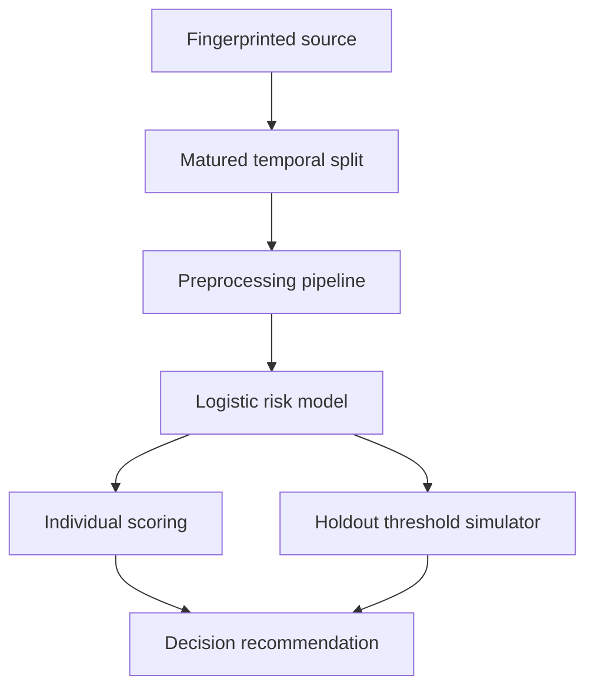

# Architecture and decision contracts

## System flow

## Contracts

| Boundary | Contract |
|---|---|
| Source → training | SHA-256 must match the validated 119,390-row snapshot |
| Raw data → split | Training booking, stay end, and resolved outcome precede cutoff; test booking is on/after cutoff |
| Split → model | Explicit 22-feature contract; leakage and mutable outcome-proxy fields excluded |
| Model → artifact | Reproduced holdout metrics must match committed results before export |
| Artifact → app | Artifact hash, feature order, and exact scikit-learn version are verified |
| Booking → score | Non-negative ADR, at least one guest, and at least one night |
| Score → action | Risk must exceed policy threshold and assumed expected value must be positive |

## Why Logistic Regression is deployed

The Random Forest has stronger average precision and ROC AUC on the later-period holdout. Logistic Regression is deployed because it is a compact artifact, has higher recall/F1 at the documented 0.50 threshold, and supports transparent signed feature contributions. This is an implementation choice, not a claim that Logistic Regression dominates every operating objective.

## Trust boundaries

- The dataset is historical and contains no randomized intervention.
- The model estimates association with cancellation, not preventability.
- Economic outputs use user-supplied success, cost, and margin assumptions.
- The holdout simulator demonstrates policy trade-offs on one later period; repeated temporal validation is still required.
- No guest-level production deployment, monitoring, or privacy assessment is included.
# Design decisions

| Choice | Reason and trade-off |
|---|---|
| Chronological holdout with matured training outcomes | Booking outcomes mature after reservation creation. The split keeps later bookings out of training and excludes unresolved earlier stays, at the cost of discarding some rows. A random split would give an optimistic view of a later-period decision. |
| Logistic Regression as the deployed artifact | Its signed contributions are cheap and directly inspectable, and the committed artifact reproduces the measured holdout scores. Random Forest has higher ROC AUC here; the deployment choice is about explainability and compact inference, not a claim that Logistic Regression dominates. |
| Saved holdout probabilities for the simulator | A visitor can vary contact and economic assumptions without downloading the source or retraining. Repeatedly exploring the same holdout does not create new validation evidence. |
| Explicit intervention assumptions | The source contains cancellation outcomes but no randomized contact treatment. The decision layer exposes success rate, recoverable margin and cost rather than presenting its scenario as measured causal uplift. |
| Local artifact integrity checks | The model and metadata are versioned together and their hashes are verified. These checks catch mismatch or corruption, but do not establish fairness, calibration or future performance. |

## Operating boundary

The Streamlit app is a portfolio demonstration over historical evidence. A real retention workflow would need a current feature feed, periodic calibration and drift checks, privacy controls, and a randomized test of whether contacts change outcomes. At materially higher traffic, model loading stays cached per process, while scoring could move to a service; the historical simulator should remain separate from a live decision log.
