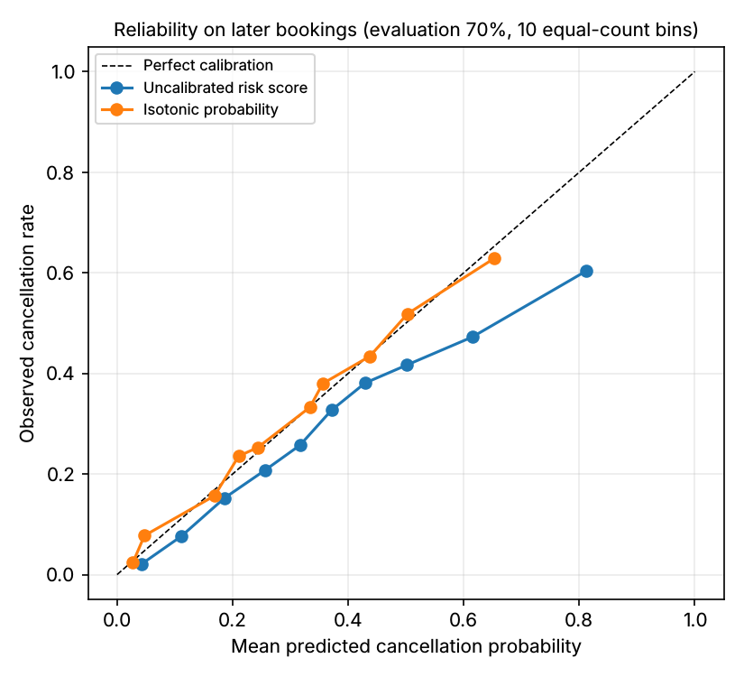

# Probability calibration and the review threshold

The deployed logistic model is trained with `class_weight="balanced"` to favour recall.
The side effect is that its output overstates cancellation rates. On later bookings the
raw score averages **36%** while **29%** actually cancelled. Ranking is unaffected.
Expected intervention value, however, multiplies a probability by money, and the risk bands
describe likelihood, so both need a calibrated number.

The system serves two numbers per booking:

| Output | Used for | Source |
|---|---|---|
| `risk_score` | ranking, the review threshold, the threshold simulator, all classification metrics | logistic pipeline |
| `cancellation_probability` | risk bands, expected intervention value | isotonic regression applied to the risk score |

Isotonic regression is monotone, so it never reorders bookings. Its step function does
create ties, which is why ranking stays on the raw score.

## Protocol

1. The logistic pipeline is trained on matured bookings before 2017-01-12.
2. The isotonic calibrator **and** the review threshold are chosen on the **earliest 30%
   of later bookings** (7,154 bookings made before 2017-02-08).
3. Both are evaluated on the **remaining 16,835 later bookings**, which the model, the
   calibrator and the threshold rule never saw.

This mirrors production practice: recalibrate and re-threshold a deployed score on its most
recent matured outcomes. One caveat: in live operation those outcomes would only be known
once the bookings' stays had passed, so a real calibrator would lag by the typical lead time.

## Calibration on the 16,835 evaluation bookings

| | Brier | Log loss | ECE (10 bins) | Mean predicted | Observed |
|---|---:|---:|---:|---:|---:|
| Raw risk score | 0.182 | 0.536 | 0.073 | 36.4% | 29.2% |
| **Isotonic probability** | **0.174** | **0.517** | **0.013** | **28.8%** | 29.2% |

Bin-level values are in [`outputs/calibration_reliability.csv`](../outputs/calibration_reliability.csv).
Platt scaling on the same split reached a Brier score of 0.175 and an ECE of 0.032, so isotonic
was kept.

**What changes for a user:** for the app's default booking, the risk score is 0.78 but the
calibrated probability is 56%. With the default assumptions (margin 100, cost 5, success
25%), the expected intervention value is 8.95. On the raw score it would have been about
14.5, overstating the value of every contact.

## The review threshold drifts

Rule: the highest risk-score threshold that catches **80%** of cancellations in the
calibration window. The result is **0.372**.

| Window | Cancellation rate | Flagged | Recall | Precision |
|---|---:|---:|---:|---:|
| Calibration (7,154, chosen here) | 37.1% | — | 80% by construction | — |
| **Evaluation (16,835)** | 29.2% | 44.8% | **69.6%** | **45.3%** |

The threshold kept its precision, but recall on later bookings fell 10 points short of the
target. The cancellation rate dropped and the mix of cancelling bookings changed. A fixed
threshold is therefore a monitoring obligation, not a one-off setting.

## History: the year feature

The first version of the model used `arrival_date_year` as a numeric input. Every booking
after the cutoff falls in 2017, beyond most of the training years, so the model
extrapolated:

- Raw scores on later bookings averaged 51% (vs 29% observed), Brier score 0.229.
- A calibrator fitted inside the training period made things *worse*: 49.5% predicted vs
  31.5% observed. A model fitted on an earlier window extrapolated the year term
  differently, so its scores did not share a scale with the final model's.
- The retrospective lead-time regression in the notebook had R² −1.83 for Ridge.

Removing the feature fixed all three. Raw-score Brier fell to 0.182, a calibrator fitted
inside the training period now transfers reasonably (ECE 0.076), and Ridge's R² became
+0.06. Ranking improved slightly (AP 0.644 → 0.646). Forward recalibration still calibrates
best (ECE 0.013), so it is what the system serves.
