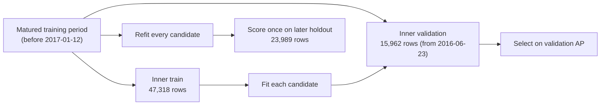

# Experiment tracking and model registry

`scripts/track_experiments.py` compares candidate models under MLflow without letting
the later holdout choose the winner.

```bash
python -m pip install -r requirements.txt -r requirements-dev.txt
python scripts/download_data.py
python scripts/track_experiments.py
mlflow ui --backend-store-uri sqlite:///mlflow.db   # http://127.0.0.1:5000
```

## Protocol



1. The same matured chronological split used for the holdout is applied again **inside**
   the training period. Inner-train outcomes resolve before the inner cutoff.
2. Every candidate shares the deployed preprocessing; only the estimator changes.
3. Selection uses **validation average precision**, because the decision is a ranking
   of which bookings to review.
4. Every candidate is refitted on the full training period and scored once on the
   holdout. Holdout numbers are reported, never used to choose.
5. MLflow records parameters, validation and holdout metrics (including Brier score),
   a holdout calibration table, the fitted pipeline with its input signature, the source
   SHA-256 and the git commit. The deployed logistic pipeline is registered as
   `hotel-cancellation-risk` with the alias `production`.

## Results (Python 3.12, scikit-learn 1.8.0)

Committed in [`outputs/experiments/model_comparison.csv`](../outputs/experiments/model_comparison.csv)
with the run manifest in [`run_manifest.json`](../outputs/experiments/run_manifest.json).

| Model | Validation AP | Holdout AP | Holdout ROC AUC | Holdout F1 @0.50 | Holdout Brier |
|---|---:|---:|---:|---:|---:|
| Prior baseline | 0.269 | 0.315 | 0.500 | 0.000 | 0.218 |
| **Logistic Regression** (deployed) | 0.467 | 0.644 | 0.775 | 0.591 | 0.218 |
| **Random Forest** (selected on validation) | **0.528** | 0.682 | 0.809 | 0.578 | 0.164 |
| Hist Gradient Boosting | 0.517 | **0.695** | **0.822** | **0.633** | **0.163** |

## What the comparison shows

- **Validation and holdout disagree on the winner.** Random Forest leads on validation;
  gradient boosting leads on the holdout. Choosing on the holdout would have reported
  0.695 AP for a model picked because it scored 0.695, an optimistic estimate. The
  protocol keeps that choice honest, and the disagreement itself is evidence that the
  ranking between tree models is not stable across periods.
- **The deployed logistic model is the weakest learned ranker, and its raw score is not a
  probability.** Its Brier score (0.218) equals predicting the base rate, because
  `class_weight="balanced"` inflates scores. The deployed system therefore pairs the score
  with an isotonic calibrator; see [calibration](calibration.md).
- **Why it is still deployed:** compact artifact, exact signed contributions, and the
  documented recall-oriented 0.50 threshold. Replacing it with a tree model is a product
  decision that would need its own calibration and a second temporal backtest.

## Reproducibility

The logistic fit uses `tol=1e-8`, so lbfgs converges fully (about 1,100 iterations)
instead of stopping at a point that depends on the BLAS build and thread count. Refits on
Python 3.12 and 3.13, single- and multi-threaded, agree to about 1e-5 in individual
probabilities and 1e-7 in holdout metrics, and every candidate reproduces the committed
metrics (`holdout_ap_delta_vs_committed` = 0).
